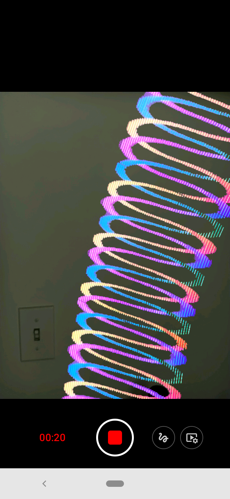
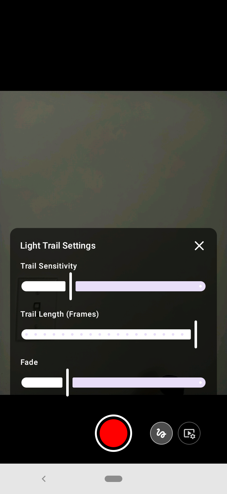
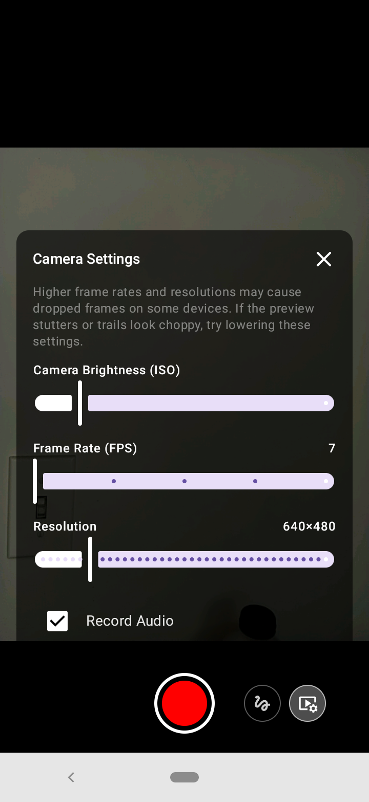

<h1>
Open Pixel Camera

</h1>

<h4>
  <a href="./MANUAL.md">User Guide</a>
  ·
  <a href="https://github.com/Mitchlol/Open-Pixel-Camera/raw/refs/heads/main/app/release/app-release.apk">Android APK Link</a>
  ·  
  <a href="https://openpixelpoi.com/">Open Pixel Poi Store</a>
  ·
  <a href="https://github.com/Mitchlol/Open-Pixel-Poi">Open Pixel Poi </a>
  ·
  <a href="https://discord.gg/WpPJEskEuM">Discord</a>
  ·
  <a href="https://www.instagram.com/openpixelpoi">Instagram</a>
</h4>

Open Pixel Camera is an open source, vibe coded, video camera app for android, intended for capturing light trails when spinning pixel poi.

#### License
[Licensed  with GPLv3](https://www.gnu.org/licenses/gpl-3.0.en.html)
If you want to donate, do it via [paypal](https://www.paypal.com/donate/?business=MTYSHEQVNBVNQ&amount=5&no_recurring=1&item_name=For+Creating+%26+Maintaing+Open+Pixel+Poi&currency_code=USD) but I would rather you purchase PCBs from our <a href="https://openpixelpoi.com/">Store</a>.